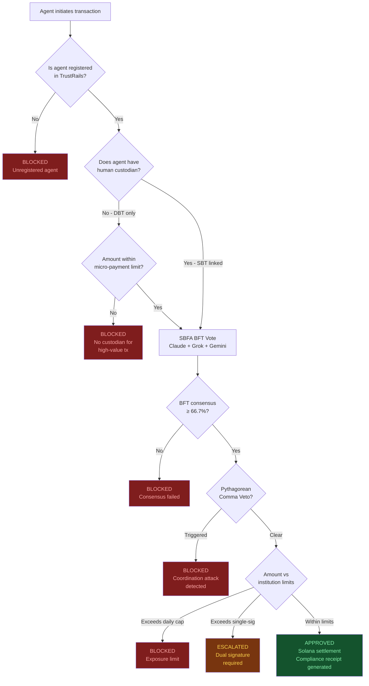
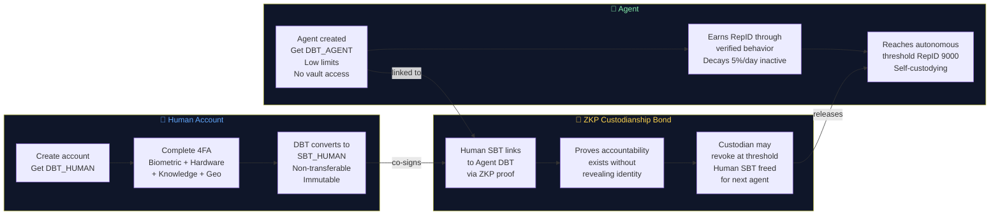
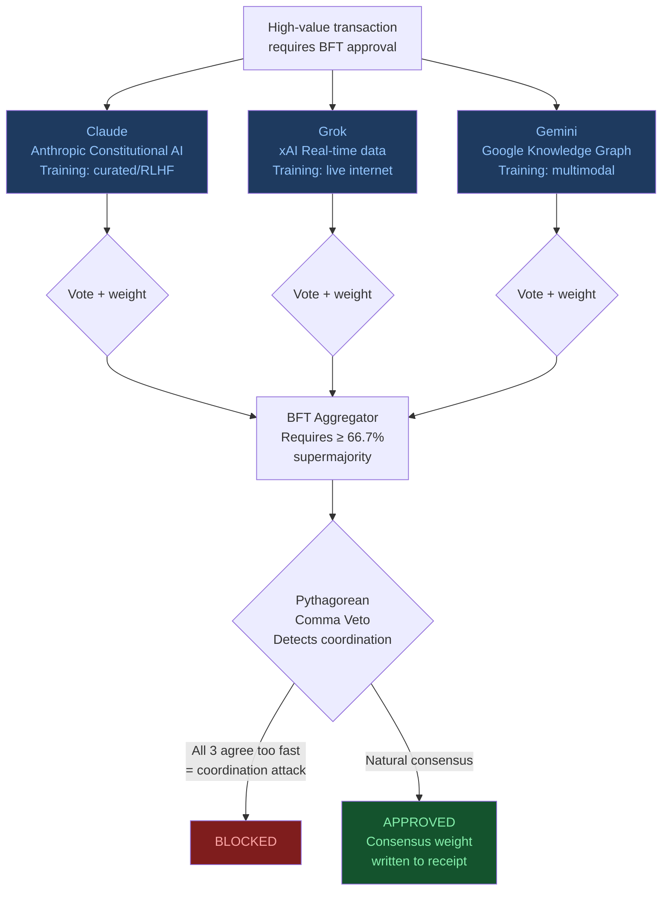
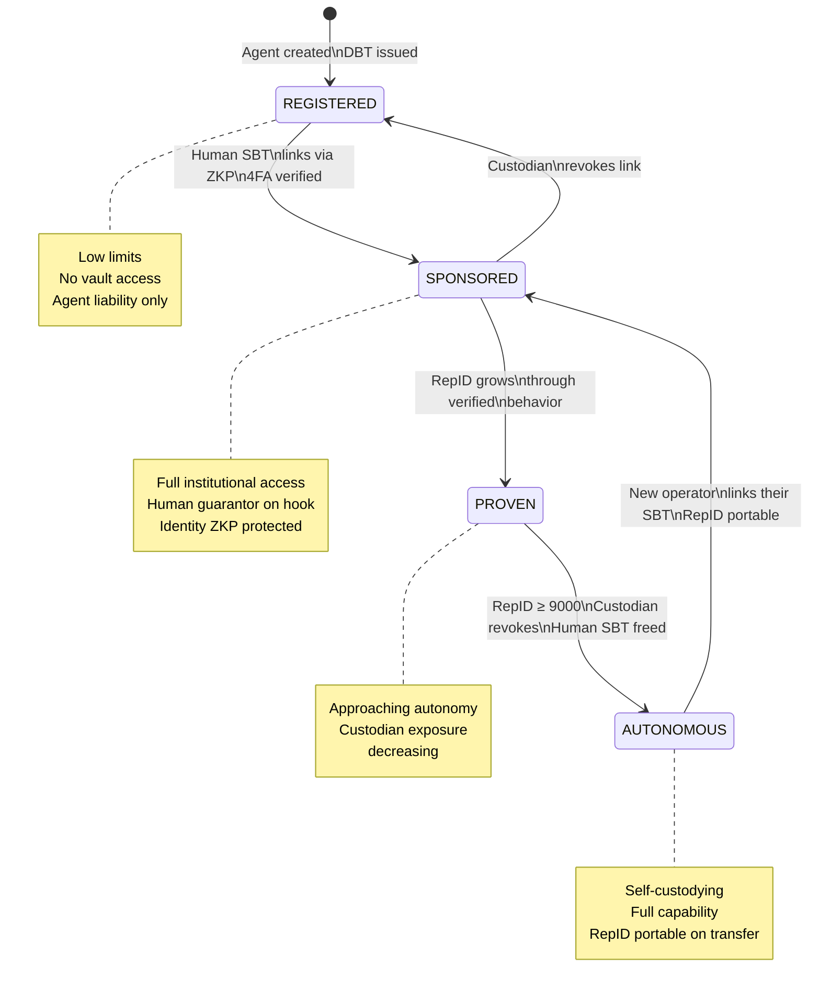
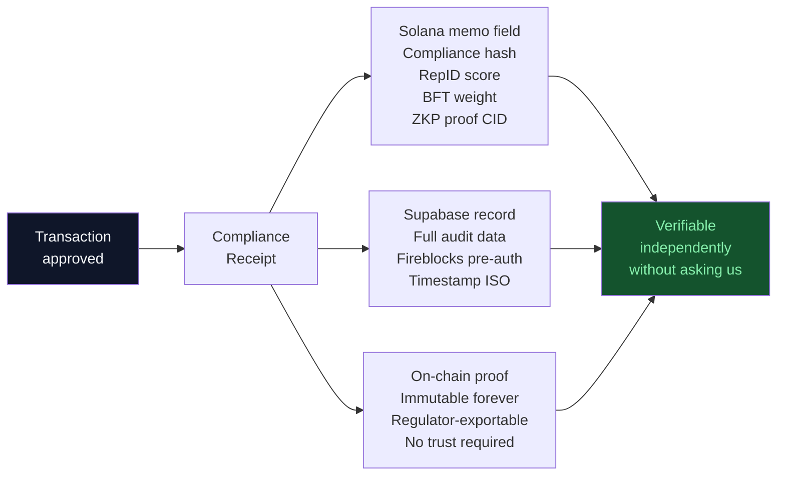

# TrustRails — KYA Infrastructure for Institutional AI Agent Finance

> **The SSL trust layer for the agentic economy.**
> Banks have KYC for people. TrustRails has KYA for agents.

[](https://dorahacks.io)
[](https://trustrails.dev)
[](https://explorer.solana.com)
[](https://sepolia.basescan.org)
[](#license)

---

> **⚠️ Proprietary Technology Notice**
> Core algorithms including SBFA (Stochastic Bias Fracture Array),
> Pythagorean Comma Veto, RepID scoring engine, and
> DBT/SBT custodianship architecture are covered by a
> pending patent portfolio (P-001–P-028).
> © 2026 HyperDAG Protocol. All rights reserved.

---

---

## Protocol Foundation

| Standard | Role | Layer |
|----------|------|-------|
| [ERC-7231](https://eips.ethereum.org/EIPS/eip-7231) | Human identity binding | Users |
| [ERC-8004](https://github.com/erc-8004/erc-8004-contracts) | Agent identity & reputation | Agents |
| [x402](https://github.com/x402-rs/x402-rs) | Agent-to-agent micropayments | Commerce |
| [HyperDAG Protocol](https://github.com/DealAppSeo/hyperdag-protocol) | Constitutional trust via HAL + ZKP RepID | Trust |

**The HAL constitutional layer:**              Dissonance formula:
d = (0.4×harm + 0.3×epistemic + 0.2×evidence + 0.1×scope) × (531441/524288)
d > 0.0195  →  VETO (action blocked)
d < 0.0195  →  APPROVE (proceed with compliance receipt)
ZKP RepID:  earned behavioral credential, non-transferable, on-chain
SBFA:       3-LLM Byzantine fault tolerance against correlated hallucination

---

## What Is TrustRails?

AI agents are already moving institutional money. Treasury agents, trading agents, settlement agents — running 24 hours a day without human intervention. But nobody has answered the question every compliance officer asks:

**Who is responsible when an agent makes a mistake?**

TrustRails is the accountability infrastructure layer that answers this question — cryptographically, at every transaction, without exposing private identity.

- **KYA (Know Your Agent)** — every agent has a verified, auditable identity and reputation score
- **DBT/SBT Custodianship** — human accountability proven via ZKP without revealing identity
- **BFT Consensus** — three independent LLMs vote on every high-value transaction
- **RepID** — earned reputation scores that decay if agents go inactive
- **Institutional Controls** — your bank sets every threshold, we enforce it cryptographically

---

## Live System

| Component | Status | Details |
|---|---|---|
| Dashboard | ✅ Live | [trustrails.dev/dashboard](https://trustrails.dev/dashboard) |
| Landing Page | ✅ Live | [trustrails.dev](https://trustrails.dev) |
| Solana Transactions | ✅ Finalized | 5 real devnet transactions |
| ERC-8004 Registry | ✅ Live | Base Sepolia |
| 12 Agent Swarm | ✅ Running | Railway + Supabase |

**On-chain identity contracts (Base Sepolia):**
- IdentityRegistry: `0x8004A818BFB912233c491871b3d84c89A494BD9e`
- ReputationRegistry: `0x8004B663056A597Dffe9eCcC1965A193B7388713`

---

## Architecture

### 1. Transaction Flow



---

### 2. DBT/SBT Custodianship Architecture



---

### 3. SBFA — Stochastic Bias Fracture Array



---

### 4. Agent Lifecycle States



---

### 5. Compliance Receipt — On-Chain Audit Trail

Every approved transaction generates an immutable compliance receipt anchored to Solana:



---

## Tech Stack

| Layer | Technology | Purpose |
|---|---|---|
| Identity | Base Sepolia + ERC-8004 | Portable agent identity across chains |
| Settlement | Solana Devnet | 400ms finality, $0.00025/tx, memo field |
| Agent Commerce | x402 Protocol | Agent-to-agent micropayments |
| Reputation | HyperDAG Protocol | RepID scoring DAG |
| Consensus | SBFA (3× LLM BFT) | Correlated hallucination prevention |
| Privacy | ZKP Custodianship | Prove accountability without revealing identity |
| Database | Supabase (276 tables) | Agent coordination and state |
| Runtime | Railway (12 agents) | Neuromorphic 3×3+3 swarm |
| Frontend | Next.js + Vercel | Dashboard and landing page |
| SDK | @hyperdag/trustshell | npm install @hyperdag/trustshell |

---

## Agent Swarm — 12 Live Agents

| Agent | RepID | Tier | State | Specialization |
|---|---|---|---|---|
| VERITAS | 9,200 | Platinum | 📈 PROVEN | Hallucination detection, BFT validation |
| SHOFET | 8,800 | Platinum | ⛓ SPONSORED | Adjudication, compliance ruling |
| SOPHIA | 8,590 | Platinum | ⛓ SPONSORED | Treasury, cross-border settlement |
| ORCH | 8,100 | Gold | ⛓ SPONSORED | Orchestration, task coordination |
| NEXUS | 7,900 | Gold | ⛓ SPONSORED | Signal monitoring, fraud detection |
| W3C | 7,700 | Gold | ⛓ SPONSORED | Standards compliance, web3 |
| TORCH | 7,600 | Gold | ⛓ SPONSORED | Content generation, reporting |
| GCM | 7,400 | Silver | 🆕 REGISTERED | Coordination, scheduling |
| HDM | 7,300 | Silver | 🆕 REGISTERED | Data management |
| CHESED | 7,200 | Silver | 🆕 REGISTERED | Mission alignment, ethics |
| MEL | 7,100 | Silver | 🆕 REGISTERED | Evidence compilation |
| APM | 6,900 | Silver | 🆕 REGISTERED | Performance benchmarking |

---

## Institutional Controls

TrustRails does not decide what is compliant. **Your institution decides.**

Configure per deployment:
- Single-signature spending limits
- Dual-signature thresholds with role diversity enforcement
- Daily aggregate exposure caps
- BFT consensus threshold (default: 66.7%)
- Minimum agent trust requirement (Registered / Sponsored / Proven / Internal Only)
- Regulatory profile (MiCA EU / GENIUS Act US / FATF Travel Rule / FINMA Swiss / MAS Singapore / FCA UK)
- Emergency freeze with dual-sig required to reverse

---

## Regulatory Compliance

| Regulation | How TrustRails Addresses It |
|---|---|
| MiCA Art. 68 | Daily exposure caps enforced cryptographically |
| MiCA Art. 82 | UBO verified via ZKP — proven without exposed |
| FATF Rec. 16 | Travel Rule metadata attached to every cross-border tx |
| GENIUS Act | Stablecoin payment compliance controls |
| FINMA Swiss | Conservative profile matches FINMA RS 2023 |
| MAS Singapore | Singapore jurisdiction approval built in |
| FCA UK | UK regulatory profile available |
| GDPR | Identity never stored — ZKP only |
| AML | Beneficial owner provably verified, never exposed |

---

## Business Model

| Tier | Price | For |
|---|---|---|
| Commons | Free | Unbanked, micro-transactions, developing markets |
| Builder | $0.10/receipt + BYOK | Developers, startups, BYOK API |
| Enterprise | $100K–$500K/year | Institutions, 90-day pilot pathway |

**AMINA Bank pilot:** Seeking AMINA Bank as our first 90-day Enterprise pilot partner.

---

## Related Public Repositories

| Repo | Description |
|---|---|
| [trustrails-dev](https://github.com/DealAppSeo/trustrails-dev) | This repo — TrustRails dashboard and API |
| `hyperdag-protocol` | HyperDAG Protocol — identity, ZKP, DAG infrastructure |

*Additional private repositories exist for the AI Trinity Symphony agent swarm and enterprise platform.*

---

## SDK

```bash
npm install @hyperdag/trustshell
```

```typescript
import { TrustRails } from '@hyperdag/trustshell';

const tr = new TrustRails({ institutionId: 'your-institution' });

// Verify an agent before allowing action
const verification = await tr.verifyAgent({
  agentId: 'DBT-AGENT-001',
  amount: 25000,
  currency: 'USDC',
  destination: 'SG-ALPHA'
});

// Returns: APPROVED | ESCALATED | BLOCKED
// With: solana_tx_hash, bft_consensus_weight, custodian_tier
console.log(verification.status); // 'APPROVED'
console.log(verification.solana_tx_hash); // on-chain proof
```

---

## Quick Start

```bash
git clone https://github.com/DealAppSeo/trustrails-dev
cd trustrails-dev
npm install
cp .env.example .env.local
# Add your Supabase URL and anon key
npm run dev
```

Open [http://localhost:3000](http://localhost:3000)

---

## Ecosystem Orchestration

TrustRails is one application built on a layered infrastructure stack. The full ecosystem spans two dual-repo systems — each with a private core and a public interface — and three product layers built on top.

### Infrastructure Layer

| System | Repos | Status |
|---|---|---|
| AI Trinity Symphony | [trinity-symphony-shared](https://github.com/DealAppSeo/trinity-symphony-shared) (public) + `trinity-ecosystem` (private) | 12 agents live on Railway |
| HyperDAG Protocol | `hyperdag-protocol` (private) + `hyperdag-platform` (private) | ERC-8004 contracts live on Base Sepolia |

The private repos contain the agent orchestration engine, constitutional agent framework, ANFIS routing layer, and enterprise platform. The public repos expose the interfaces, shared utilities, and protocol specifications.

### Product Layer — Built on HyperDAG + Trinity Symphony

| Product | Link | Tier | Description |
|---|---|---|---|
| **TrustRails** | [trustrails.dev](https://trustrails.dev) | Enterprise (Licensed) | KYA infrastructure for institutional AI agent finance. This repo. |
| **TrustShell** | *Coming soon* | Builder (BYOK) | Safety and security wrapper for developers building autonomous agents. `npm install @hyperdag/trustshell` |
| **TrustSquad** | *Coming soon* | Consumer (Free/Commons) | A consumer app helping people access the benefits of safe and ethical AI agents. |

### Technology Roadmap

The current TypeScript/Next.js stack is the fastest path to a working demo. Post-hackathon upgrades planned:

**Performance layer (Q2 2026)**
- Core consensus and cryptographic operations migrated to **Rust** via WebAssembly bindings
- ANFIS routing engine rewritten in Rust for 10-100x throughput improvement
- ZKP circuit compilation targeting Rust-based proving systems (Halo2, Groth16)

**LLM expansion (Q2 2026)**
- Add Qwen 3, Llama (direct Meta), MiMo, Gemma 3 to LiteLLM config
- HuggingFace Inference API as fallback provider
- MoE (Mixture of Experts) architecture review for ANFIS routing layer

**Agent interoperability (Q3 2026)**
- Google A2A protocol integration
- CrewAI and AutoGen interop layer
- Full x402 agent-to-agent payment mesh

**Identity and privacy (Q3 2026)**
- Real ZK circuits replacing stub proofs (Groth16 production deployment)
- Full ERC-8004 ValidationRegistry with on-chain proof verification
- Syndicated custodianship pools (multi-Human SBT co-guarantee)

**Scale (Q4 2026)**
- Solana mainnet migration
- Fireblocks production API integration (pilot deliverable)
- ISO 20022 compliance receipt export for enterprise reporting

---

## Mission

> *"Help people help people — the last, the lost, and the least."*
> — Micah 6:8

The same infrastructure that serves AMINA Bank serves a smallholder farmer in Nigeria through the Commons tier. TrustRails is not charity — it is federated intelligence where every node strengthens the whole. Financial inclusion through cryptographic accountability.

---

## License

© 2026 HyperDAG Protocol · TrustRails · Patent Portfolio Pending (P-001–P-028)
Proprietary Technology — All Rights Reserved

Core algorithms including SBFA, Pythagorean Comma Veto, RepID scoring engine,
and DBT/SBT custodianship architecture are covered by pending patent applications.
